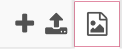
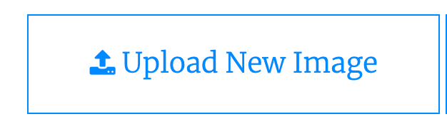
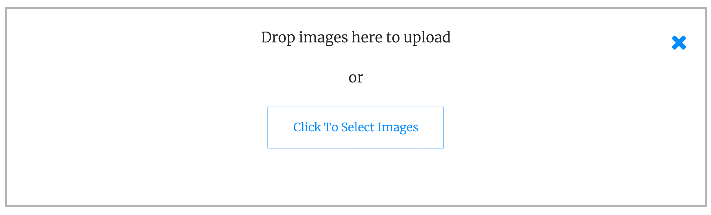

## Build a page template

Before you create your website, it's helpful to create a template, to keep your pages looking similar. 

Add all the common parts of the site to your template:

  + Include a menu to link together all the pages you're going to create
  + Include a header, so people know what the site is about
  + Include a location for the main content of the page — which will change for each page based on your template


--- task ---

Create a `template.html` page in your website and add the `container`, `header`, `nav`, and `main` `div` tags.

--- collapse ---
---
title: Basic website template code
---

A good basic structure for a webpage is a set of `div` tags that divide it into areas for heading information, a navigation menu, and page content.

```html
<div class="container">
    <div class="header">
        <!-- Your site title, logo, slogan, etc. can go here -->
        <div class="nav">
            <!-- Your menu, for navigating the site, can go here -->
        </div>
    </div>
    <div class="main">
        <!-- This section changes for each page, and contains what you want the page to tell the visitor -->
    </div>
</div>
```

If you want to include things at the bottom of each page, you can put them in a `div` with a `footer` class.

--- /collapse ---

--- collapse --- 
---
title: The div tag
---

A `div` is an invisible rectangle. It has no width or height unless you do something to give them to it. You can give a `div` width and height with the CSS `width` and `height` properties. You can also put another element inside the `div`, and the `div` will grow to hold that element.

```html
    <div>
        <!-- Whatever you want to put in your div -->
    </div>
```

--- /collapse ---

--- save ---

--- /task ---

--- task ---

Create a CSS file and link it to your template page.

--- collapse ---
---
title: Linking CSS to a webpage
---

CSS is stored in one or more `.css` files — called stylesheets — which are separate from your `.html` files. You include the CSS on your `.html` webpages by using the `link` tag, placed inside the `head` tag of your page. If your stylesheet is called `style.css` and stored in the same directory as your `.html` page, you would include it like this: 

```html
<head>
    <link rel="stylesheet" href="style.css">
</head>
```

--- /collapse ---

--- save ---

--- /task ---

--- task ---

Add a heading to your webpage, inside the `header` `div`. Use the `h1` tag to make it stand out.

**Choose:** If you want your website to have a logo, you can add it here using the `img` tag.

--- save ---

--- collapse ---
---
title: Adding images to Trinket
---

To add an image to your Trinket project, first choose the Images section by selecting this icon.



Next, choose the "Image Library" button.


In the screen that opens, select "Upload New Image".



Then drag the images you want to upload into the box that appears.



--- /collapse ---

--- collapse ---
---
title: Including images in your webpage
---

The `img` tag is used to include pictures on a webpage. It has two attributes that must be set when doing so:

 + `src` — the source location of the image file, including the file name
 + `alt` — the alternative text description of the image, for users who rely on assistive tools, like screen readers, to browse your site

 ```html

 ```

--- /collapse ---

--- collapse ---
---
title: Setting width and height with CSS
---

You can set the `width` and `height` properties of a HTML element:

```css
.my_class{
    height: 150px;
    width: 90%;
}
```

**Tip**: You can set these properties with `px`, which won't adjust based on the visitors screen, or with `%` which will. You may want to use a mix of both to achieve the effect you want.

--- /collapse ---

--- save ---

--- /task ---

--- task ---

Add a menu to your webpage, including links to all of the pages you're going to add to your site. Make sure that they're relative links.

--- save ---

--- collapse ---
---
title: Creating links
---

A hyperlink is created with the `a` tag, like this:

```html
<a href="https://raspberrypi.org">the Raspberry Pi website</a>
```

Hyperlinks can be absolute, or relative, links.

<p style="border-left: solid; border-width:10px; border-color: #0faeb0; background-color: aliceblue; padding: 10px;">
<span style="color: #0faeb0">**Absolute links**</span> use the full address of a page, like `https://example.com/about.html`. This is like giving the full street address of a house — anyone can use that information to find it. 
</p>

<p style="border-left: solid; border-width:10px; border-color: #0faeb0; background-color: aliceblue; padding: 10px;">
<span style="color: #0faeb0">**Relative links**</span> include only the steps needed to get to a file from the file containing the link. If they're in the same directory, this is just the name of the file, like `about.html`. This is like giving someone directions to a house — 'take the second left, then the thrid right' — the directions only work for someone starting from that spot. They are used between pages in the same site so they don't need to be changed if the whole site gets moved around the internet.
</p>

--- /collapse ---

--- collapse ---
---
title: Creating a list with HTML
---

You can create a list with HTML by using either the `ol` tag to get an ordered list — one that has letters or numbers beside each item — or using `ul` to get an unordered list — one with dots, squares, or other symbols beside each item.

Each item on the list is then placed inside a list item (`li`) tag, like this:

```html
<ol>
    <li>First list item</li>
    <li>Second list item</li>
    <li>Third list item</li>
</ol>
```

--- /collapse ---

--- collapse ---
---
title: Using CSS to turn a list into a menu
---

Menus are made by using unordered lists (`ul`) of hyperlinks (`a`) and adding some special CSS rules.

For the `div` that surrounds the `ul`:

```css
.menu{
    /*
    Add some padding to give the menu space.
    */
    padding-top: 10px;
    padding-bottom: 10px;
    /*
    These rules will be explained later,
    in a more advanced project. 
    They create the space between menu items.
    */
    margin: 0; 
    display: flex;
    justify-content: space-evenly;
}
```

For the hyperlinks (`a`) that appear inside the list items (`li`):

```css
.menu a{
    /*
    Turn off the usual hyperlink underlines
    */
    text-decoration: none;
}
```

--- /collapse ---

--- /task ---