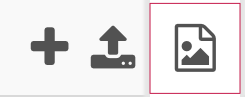
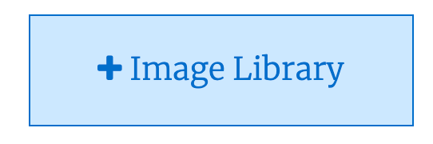
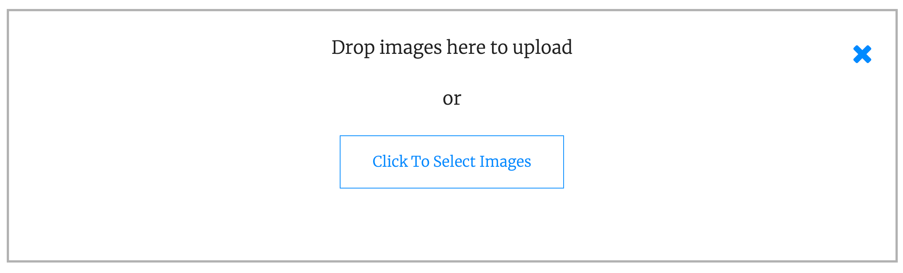

## Fill your pages

Now that they have the template in place, you can add the page-specific elements to your page.

--- task ---

Use the HTML and CSS you've learned to create your website's homepage, as well as the extra page you planned.

You may want to use some of the elements and styles mentioned on other pages, as well as some of the ones listed below.

--- save ---

[[[generic-get-picture-from-web]]]

[[[images-permissions-to-use]]]

--- collapse ---
---
title: Adding images to Trinket
---

To add an image to your Trinket project, first choose the Images section by selecting this icon.



Next, choose the "Image Library" button.



In the screen that opens, select "Upload New Image".


Then drag the images you want to upload into the box that appears.



--- /collapse ---

--- collapse ---
---
title: Including images in your webpage
---

The `img` tag is used to include pictures on a webpage. It has two attributes that must be set when doing so:

 + `src` — the source location of the image file, including the file name
 + `alt` — the alternative text description of the image, for users who rely on assistive tools, like screen readers, to browse your site

 ```html

 ```

--- /collapse ---

--- collapse ---
---
title: Creating links
---

A hyperlink is created with the `a` tag, like this:

```html
<a href="https://raspberrypi.org">the Raspberry Pi website</a>
```

Hyperlinks can be absolute, or relative, links.

<p style="border-left: solid; border-width:10px; border-color: #0faeb0; background-color: aliceblue; padding: 10px;">
<span style="color: #0faeb0">**Absolute links**</span> use the full address of a page, like `https://example.com/about.html`. This is like giving the full street address of a house — anyone can use that information to find it. 
</p>

<p style="border-left: solid; border-width:10px; border-color: #0faeb0; background-color: aliceblue; padding: 10px;">
<span style="color: #0faeb0">**Relative links**</span> include only the steps needed to get to a file from the file containing the link. If they're in the same directory, this is just the name of the file, like `about.html`. This is like giving someone directions to a house — 'take the second left, then the thrid right' — the directions only work for someone starting from that spot. They are used between pages in the same site so they don't need to be changed if the whole site gets moved around the internet.
</p>

--- /collapse ---

--- collapse ---
---
title: Including YouTube video in your webpage
---

First, go to the video you want to include on YouTube and click the "share" button.


In the dialogue that opens you'll see a few ways you can share the video. Choose "Embed". Embedding means to include one thing inside another — this YouTube video will be embedded in your webpage.


In the dialogue that opens you'll see a few options you can use to modfiy the version of the video that will be shared on your webpage. Choose "Copy"


Paste the copied code into your webpage. This is an `iframe` tag. Remove its `width` and `height` attributes. Give it the same class you used on other elements to give them the `width`, `height`, and `float` properties that make them part of your grid. It should now be the right size and shape to fit neatly onto your page.
--- /collapse ---

--- collapse ---
---
title: Making a grid layout with CSS
---

You can create a grid of `div` and `img` tags, like in [board project needs a better name](#) by using a few pieces of CSS. So the HTML might look like this:

```html
<div class="grid_container">
    <div class="grid_tile">
        <p>Inspiring quote</p>
    </div>
    
</div>
```

Choose a width for the entire grid, and then divide that evenly into tiles. So, for example, a `900px` grid could break neatly into `300px` tiles. The basic CSS is below, but don't forget that you can add background colours to your grid and your tiles. You can even add borders — though you'll need to adjust the `grid_tile` width if you do so.


```css
.grid_container{
    width: 1200px;
    /*
    overflow:hidden is needed to make
    the container stretch around the tiles
    */
    overflow: hidden;
}

.grid_tile{
    /* make the tiles flow into a grid */
    float: left;
    /* divide the container width evenly */
    width: 300px;
    /* match the tile width, to get nice squares */
    height: 300px;
}
```

You can also create extra classes to make a tile that is double the width, or has a specially coloured background, a different font, etc.

--- /collapse ---

--- collapse ---
---
title: Adding borders to an element
---

You can add borders to an element using a set of CSS properties, all of which have 'border' in their name!

```css
.my_class{
    /* Borders can be any colour you like */
    border-color: green;
    /* 
    They can be different styles. 
    See below for a few examples 
    */
    border-style: dotted;
    /* 
    Borders can have any width you like.
    Remember that they increase the width of
    the element they're added to!
    */
    border-width: 3px;
}
```

Here are a few border styles:
<html>
<div style="border: 2px dotted black; float: left; margin-right: 5px;">
    dotted
</div>

<div style="border: 2px dashed black; float: left; margin-right: 5px;">
    dashed
</div>

<div style="border: 2px solid black; float: left; margin-right: 5px;">
    solid
</div>

<div style="border: 2px double black; float: left; margin-right: 5px;">
    double
</div>

<div style="border: 2px groove black; float: left; margin-right: 5px;">
    groove
</div>
</html>
--- /collapse ---

--- collapse ---
---
title: Using more than one class for the same element
---

Sometimes it makes sense to use more than one class for the same element. You just separate the names of the classes with a space. You can use as many classes as you like this way. If the rules in two classes conflict, the rule that appears later in the CSS file will win.

```html
<div class="grid_tile red"> 
    <!-- some text/images/etc. in here --> 
</div>
```

This is useful when, for example, several elements are the same size and shape but different colours.

--- /collapse ---

--- /task ---